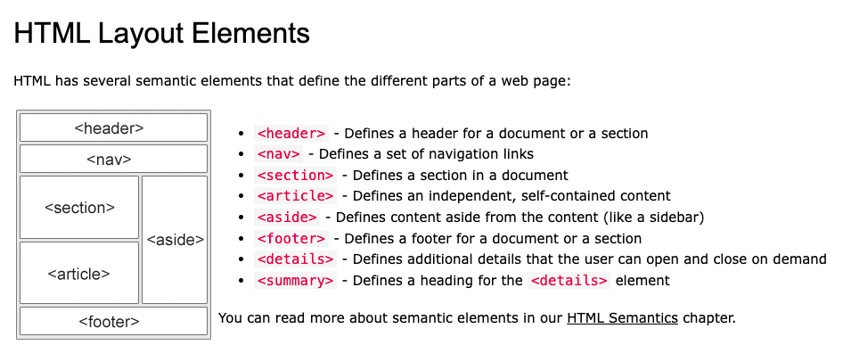

# hw1-code-refactor-JD

By Jessie Doherty

## Homework URLs:

- Repo: https://github.com/zhuzhu930/hw1-code-refactor-JD
- Github page: https://zhuzhu930.github.io/hw1-code-refactor-JD/

I've done the following steps:

## 1. Evaluation of the original HTML and CSS files.

- Check the "link" and "a" tags to see whether everything works. I found the link of "search-engine-optimization" is not working properly.
- Check the tags. I've found that the original html was marked with mainly "div" tags, not semantic tags.
- Original "img" tags do not have "alt" attributes.
- Original CSS has a lot of redundunt selectors and codes.

## 2. Making changes based on my evaluation in both HTML and CSS.

In HTML, I've made the following changes:

- changing the "title" content into "Horiseon Website", though this part won't show on the page, it makes the computer know more about what this file is about.
- changing the "div" tags in the header part into "header" tag. Changing the nested "div" tags into "nav" tag to show the 3 links in the navigation bar. Deleting the unnecessary "header" class.
- changing the "div" with id="hero" into a more proper "img" tag with source link. Adding "alt" attribute to the image.
- According to the w3schools, the typical layout of a webpage is:
  

  So I made the left part into a section, by using "section" tag. In the first "div", I need to add an "id" for "search-engine-optimization" so it links to the navigation menu.
  Deleting the unnecessary "class" on the "section" tag.
  Adding "alt" attributes to all images.

- Based on the layout, I've made the right part into a side bar by using "aside" tag. Deleting the unnecessary "class" on the "aside" tag. Adding "alt" attributes to all images.
- Based on the layout, I've changed the last "div" into "footer" since this part serves as a footer of the page. Deleting the unnecessary "class" on the "footer" tag.

In CSS, I've made the following changes:

- Since I've chagned a lot of the "div" tags into semantic tags in HTML, I've updated the selectors in CSS to make it more concise.
- In the "section" tag, I've updated the class for each "div" container, and used only one set of code in CSS.
- In the "aside" tag, I've updated the class for each "div" container, and used only one set of code in CSS.

## 3. Review all changes I've made to make sure they meet the criteria. Check the HTML page in browswer to see whether it displays properly.

## 4. Adding comments in HTML for reviewers.

- I've added some comments in the HTML and CSS to clarify my changes.
- I've commented out the redundant codes so CSS won't run it, still leaving the record for the reviewers.

## 5. Write the README.md, to summarize what I've done.

## 6. How I did my research.

- I did my research on w3schools, MDN web docs to understand the functionalities of tags.
- I also found that by using "inspect" feature on a webpage can help me get what I want quicker.

## In conclusion:

I really enjoyed this homework, as it helped me read codes more carefully, thinking about the ways to improve them. The end result is a more accessible webpage with cleaner codes.
